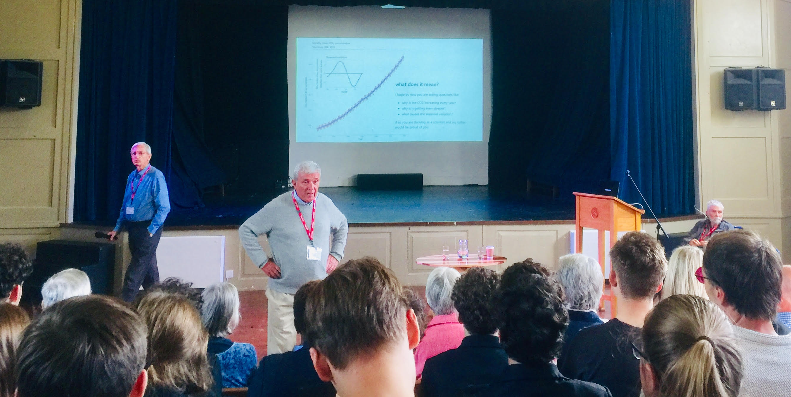

# Sidcot School Darwen Lecture 2019

The [Darwen](https://en.wikipedia.org/wiki/John_Davies,_1st_Baron_Darwen) lecture is held every year at Sidcot School, and on 20190925 wAS 
given by my brother Hammond Murray-Rust. "Algae, Sunshine and Snakes; threats to sustainability in Florida" . My brother Alan gave a history of 
our time at the school and I gave a 3-min presentation on the [Keeling Curve (ppt)](KeelingSidcot.pptx) and [README](README.md) (all under CC BY).

## brief report
The event was very well attended - ca 350 12-18 year-olds with some teachers and local visitors. Hammond had explained the problem of resources 
(especially sub/tropical) and the students had also attended climate strike the week before. I was really struck by the keen interest and especially the excitement and
questions (we massively ran out of discussion time).

Here's a . Credit : Joanna Hodnett (Sidcot School) released under CC BY (Attribution, 4.0).
(the speaker are L to R: Alan M-R, Hammond M-R and (far right, seated) Peter M-R). Note the Keeling curve in the background.

## conclusion and how to use the material
The [Keeling Curve](https://en.wikipedia.org/wiki/Keeling_Curve) has a nice narrative. use Wikipedia to recount the history - stress the care he took (decimal points!), the timescale (50 years) and
the commitment (every month on the top of a 3000m mountain). Also mention thathis bosses thought it was routine and removed his funding and he had to scrape to keep it going.
Paint Charles Keeling as a hero (because he is!). 

Ask the audience the questions in the material. 

